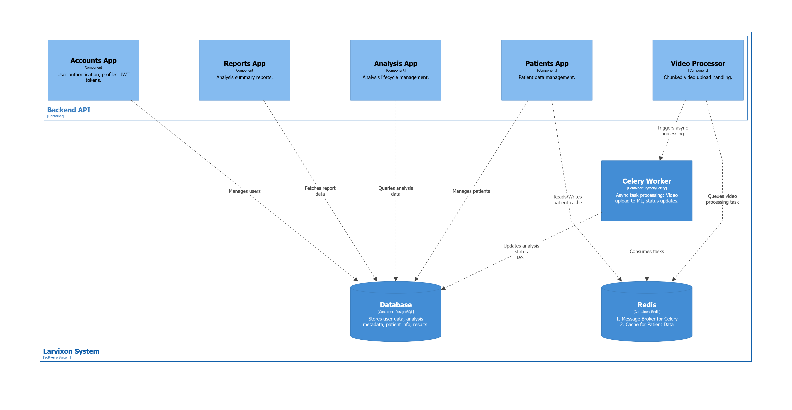

## Modular Structure (C3)

The application code is divided into functional domains following the _Separation of Concerns_ principle.

Key modules:

- **accounts**: Identity management and JWT.
- **analysis**: Analysis lifecycle and results.
- **patients**: Integration with the patient service.
- **videoprocessor**: Upload handling and ML task delegation.

## API Design

Communication is based on REST architecture. The API is fully documented using the OpenAPI (Swagger) standard.

| Method | Endpoint              | Description      |
| :----- | :-------------------- | :--------------- |
| GET    | `/api/patients/`      | List of patients |
| POST   | `/api/video/upload/`  | Video upload     |
| GET    | `/api/analysis/{id}/` | Analysis results |

## Layered Architecture

The system implements logical layering:

1.  **Presentation Layer**: Views and serializers (Django REST Framework).
2.  **Business Logic Layer**: Services (Strategy Pattern, e.g., `BasePatientService`).
3.  **Data Layer**: Django ORM models.
