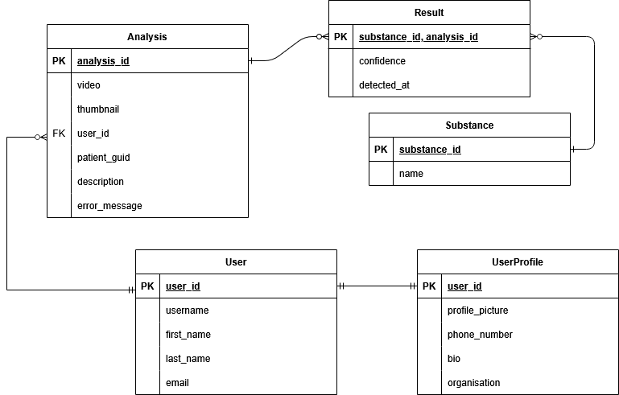
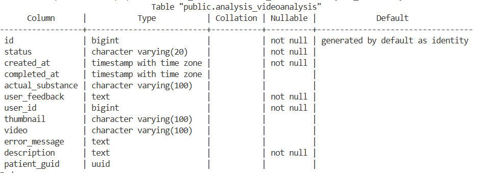
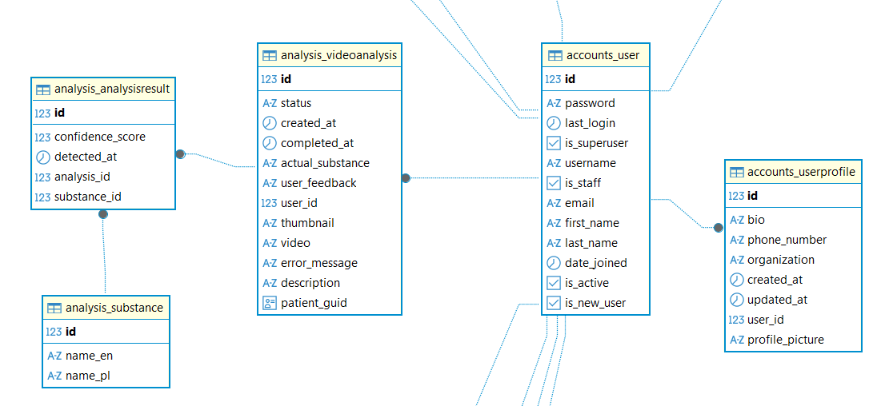

## Conceptual Model

The core of the system connects the user with analyses and detection results.

- **User - Profile** (1:1)
- **User - Analysis** (1:N)
- **Analysis - Result** (1:N)

## Physical Implementation

The database was implemented using the _Code-First_ approach with Django ORM.

### Analysis Table

The main `videoanalysis` table stores processing metadata and statuses.

### Results

The `analysisresult` table links an analysis to a substance, storing the model's confidence. A `UNIQUE TOGETHER` constraint is applied to `(analysis_id, substance_id)` pairs.

