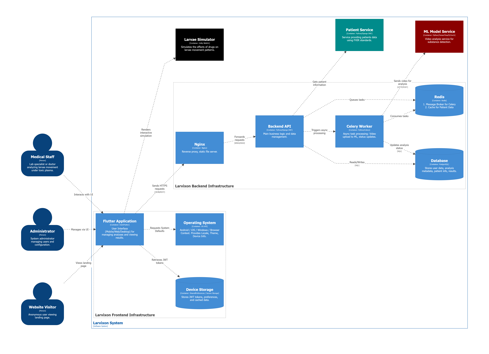

## Code Repositories

The system is divided into independent components hosted in the GitHub organization [LarvixON-ZPI](https://github.com/LarvixON-ZPI). Key repositories include:

- Backend (Django)
- Frontend (Flutter)
- ML Model (PyTorch)
- Patients Service (FastAPI)
- Simulation (Unity)

## General Architecture

The backend architecture follows the modular monolith pattern, separating business logic from computational processes.

### Context Diagram (C1)

### Container Diagram (C2)

The system consists of the following infrastructure elements:

1.  **Django App:** API and business logic.
2.  **Celery Worker:** Asynchronous video processing.
3.  **Redis:** Message broker and cache.
4.  **PostgreSQL:** Relational database.
5.  **Nginx:** Reverse proxy.

## Cloud Infrastructure (Azure)

The system utilizes Managed Services to ensure scalability:

- **Azure Database for PostgreSQL**: Metadata storage.
- **Azure Cache for Redis**: Task queue management.
- **Azure Blob Storage**: Video file storage (integrated via `django-storages`).
