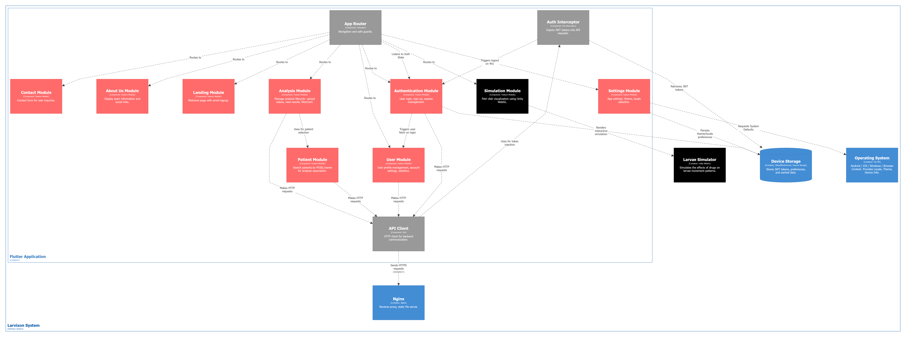
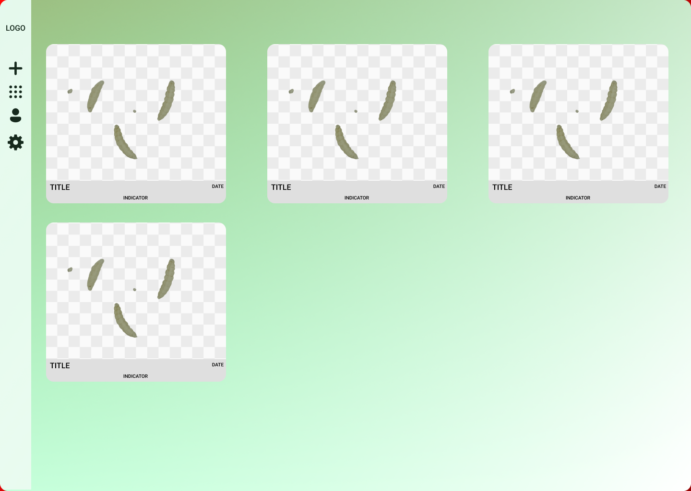
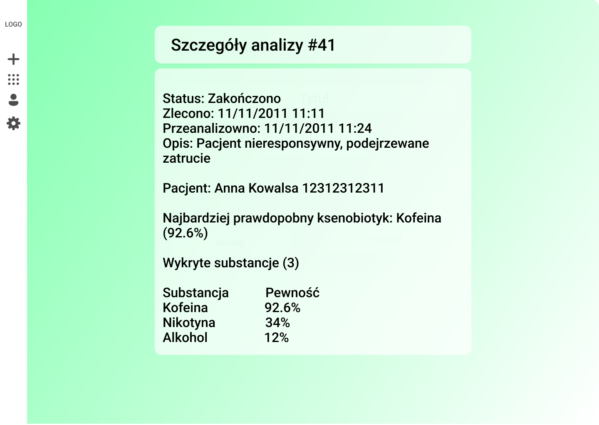

## Architecture and Technologies

The client application was built using the **Flutter** framework (supporting Web, Android, Windows). A layered architecture inspired by **Clean Architecture** was applied:

1.  **Data Layer**: Repositories, DTOs, Dio (HTTP).
2.  **Domain Layer**: Business entities.
3.  **Presentation Layer**: UI and BLoC.

## Design Patterns

- **BLoC (Business Logic Component)**: Separation of logic from UI, state management.
- **Repository**: Data source abstraction.
- **Dependency Injection**: Dependency management.
- **Factory**: Creating error objects (`ApiFailure`).

## UI Prototype (Figma)

The interface design included login screens, analysis lists, and examination details.

| Screen            | Description                                          |
| :---------------- | :--------------------------------------------------- |
| **Analysis List** | Grid of performed examinations with filtering.       |
| **Details**       | Detection confidence charts and patient metadata.    |
| **Wizard**        | Multi-step process for commissioning a new analysis. |

