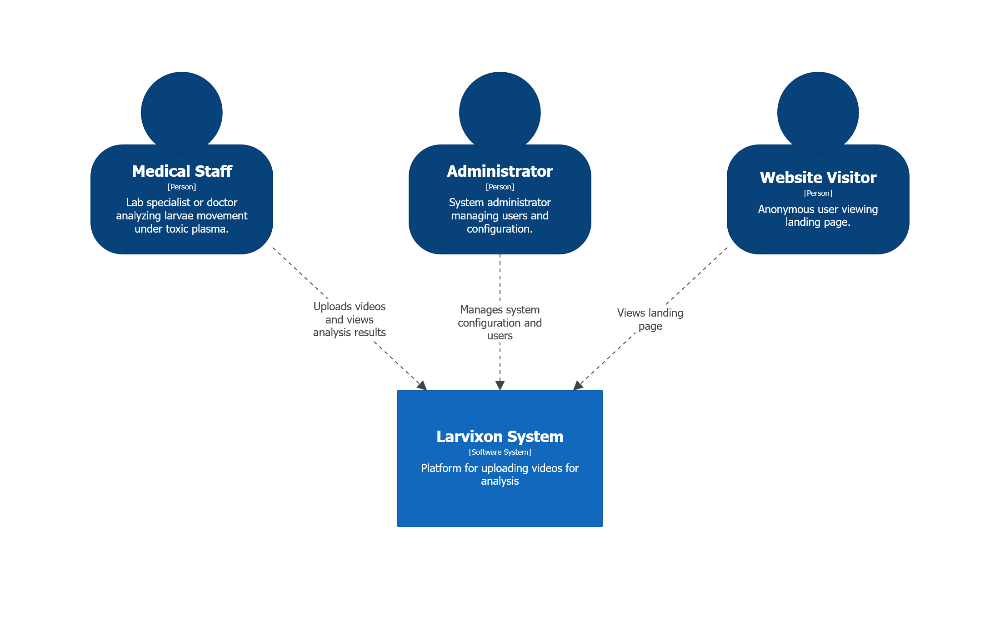

## Functional Requirements

Below is a list of functional requirements grouped into Epics, defined in the form of User Stories.

### Epic 1: User Management

1.  **US-1.1** As a new user, I want to register in the system to access the platform.
2.  **US-1.2** As a registered user, I want to log in to the system to access my analyses.
3.  **US-1.3** As a logged-in user, I want to edit my data to update information about myself.

### Epic 2: Analysis Management

1.  **US-2.1** As a logged-in user, I want to upload a video recording of larvae so that the system can analyze it.
2.  **US-2.2** As a logged-in user, I want to see a list of all my analyses to track progress and review results.
3.  **US-2.3** As a logged-in user, I want to view the details of a specific analysis to examine results and make medical decisions.
4.  **US-2.4** As a logged-in user, I want to be able to delete an analysis to remove unnecessary data.
5.  **US-2.5** As a logged-in user, I want to retry an analysis if I have doubts or if the analysis failed.
6.  **US-2.6** As a logged-in user, I want to export analysis results as a PDF document to print results and share them with staff members.

### Epic 3: System Information

1.  **US-3.1** As a user, I want to send a message to the team to ask a question regarding the system.

_System Context Diagram (C1 layer of C4 model)_

## Non-Functional Requirements

### Performance and Scalability

1.  **NFR-1.1** The system should allow asynchronous processing of video files so that the ML analysis process does not block the user interface or the main server thread.
2.  **NFR-1.2** API response time for standard operations (fetching lists, login) should not exceed 500 ms under stable internet connection conditions.
3.  **NFR-1.3** The system should support video files up to 3 GB in size.
4.  **NFR-1.4** The behavioral simulation should run with a minimum fluidity of 30 frames per second (FPS) on reference office hardware.

### Security and Data Protection

1.  **NFR-2.1** Communication between client and server must be encrypted using the HTTPS protocol.
2.  **NFR-2.2** User passwords must be stored in the database in an encrypted form.
3.  **NFR-2.3** Access to patient data and analysis results must be protected by an authentication mechanism based on JWT tokens.
4.  **NFR-2.4** The system must enforce a password policy (minimum 8 characters).

### Usability and Compatibility

1.  **NFR-3.1** The client application must be compilable and runnable as a native application on Android, Windows, and Linux systems, as well as a browser application.
2.  **NFR-3.2** The user interface must be responsive and adapt to the input method (touch vs. mouse/keyboard).
3.  **NFR-3.3** The application must support internationalization and allow dynamic interface language switching (Polish/English).
4.  **NFR-3.4** The system should inform the user about the status of long-running operations using progress indicators or skeleton screens.

### Reliability and Error Handling

1.  **NFR-4.1** In case of server unavailability or lack of internet connection, the application should display a readable error message.
2.  **NFR-4.2** The system should validate uploaded video files for format before starting the processing workflow.

## Requirements Realization and Project Management

To effectively organize the team's work and monitor progress in implementing defined functional requirements, the **GitHub Projects** platform was used. An Agile project management methodology with a Kanban board was adopted.

The requirements management process proceeded as follows:

1.  **Task Definition:** Each previously defined _User Story_ was translated into specific _Issues_.
2.  **Estimation and Prioritization:** Tasks were added to the _Backlog_, where they were prioritized.
3.  **Task Lifecycle:** Tasks moved through statuses: _Ready_, _In Progress_, _In Review_, and _Done_.

This approach ensured _traceability_, and close cooperation with the Medical University of Wrocław allowed for the verification of project assumptions.
