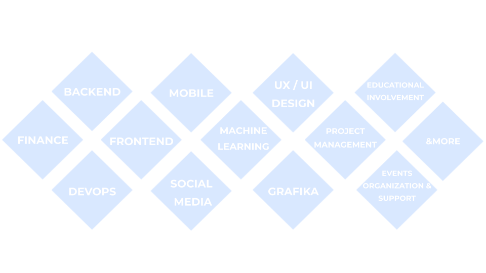

import {
  Steps,
  Card,
  CardGrid,
  LinkCard,
  Aside,
} from "@astrojs/starlight/components";

## Witamy w dokumentacji LarvixON AI 🦋

**Politechnika Wrocławska**  
**Wydział Informatyki i Telekomunikacji**  
Kierunek: IST  
**Zespołowe Przedsięwzięcie Informatyczne**

System LarvixON AI to nowatorskie rozwiązanie diagnostyczne wykorzystujące sztuczną inteligencję do wykrywania ksenobiotyków w osoczu pacjentów poprzez analizę wzorców ruchowych larw _Galleria mellonella_.

<Aside type="tip">
  Celem projektu jest osiągnięcie wysokiej czułości i specyficzności
  klasyfikacji przy czasie analizy nieprzekraczającym **20 minut**.
</Aside>

## Szybki start

<CardGrid>
  <LinkCard
    title="Opis projektu"
    href="/project/overview/"
    description="Poznaj cele i zakres projektu"
  />
  <LinkCard
    title="Technologie"
    href="/project/technologies/"
    description="Stack technologiczny i narzędzia"
  />
  <LinkCard
    title="Roadmapa"
    href="/project/roadmap/"
    description="Plan i kamienie milowe projektu"
  />
  <LinkCard
    title="Zespół"
    href="/project/team/"
    description="Członkowie zespołu i opiekun"
  />
</CardGrid>

## O projekcie

Projekt LarvixON AI opracowuje szybki system diagnostyczny oparty na AI, który analizuje wzorce ruchowe larw w celu identyfikacji charakterystycznych reakcji organizmu na toksyczne substancje. System łączy:

- 🔬 **Badania naukowe** - analiza danych ruchowych i ekstrakcja cech behawioralnych
- 💻 **Inżynieria oprogramowania** - aplikacja diagnostyczna z pełnym pipeline
- 🤖 **Uczenie maszynowe** - modele klasyfikacyjne do wykrywania ksenobiotyków
- 🏥 **Zastosowania medyczne** - wsparcie diagnostyczne w czasie rzeczywistym

## Główne komponenty

<CardGrid>
  <Card title="Backend (Django)" icon="seti:django">
    Skalowalny backend z API REST, zarządzanie danymi i logika biznesowa
  </Card>
  <Card title="Frontend (Flutter)" icon="seti:flutter">
    Wieloplatformowy interfejs użytkownika dla lekarzy i laborantów
  </Card>
  <Card title="Model ML (Python)" icon="seti:python">
    Algorytmy uczenia maszynowego do analizy wzorców behawioralnych
  </Card>
  <Card title="Symulacja (Unity)" icon="seti:unity">
    Generowanie syntetycznych danych treningowych
  </Card>
</CardGrid>

## Infrastruktura

- **Wrocławskie Centrum Superkomputerowe (WCSS)** - moc obliczeniowa dla ML
- **PostgreSQL** - baza danych systemu
- **Docker** - konteneryzacja aplikacji
- **Microsoft Azure** - hosting i usługi chmurowe
- **Roboflow** - anotacja danych wideo

## Status projektu

Projekt jest obecnie w **Fazie III: Integracja i Optymalizacja** (październik 2025). Trwają prace nad połączeniem wszystkich komponentów systemu oraz optymalizacją modeli uczenia maszynowego na rzeczywistych danych.

