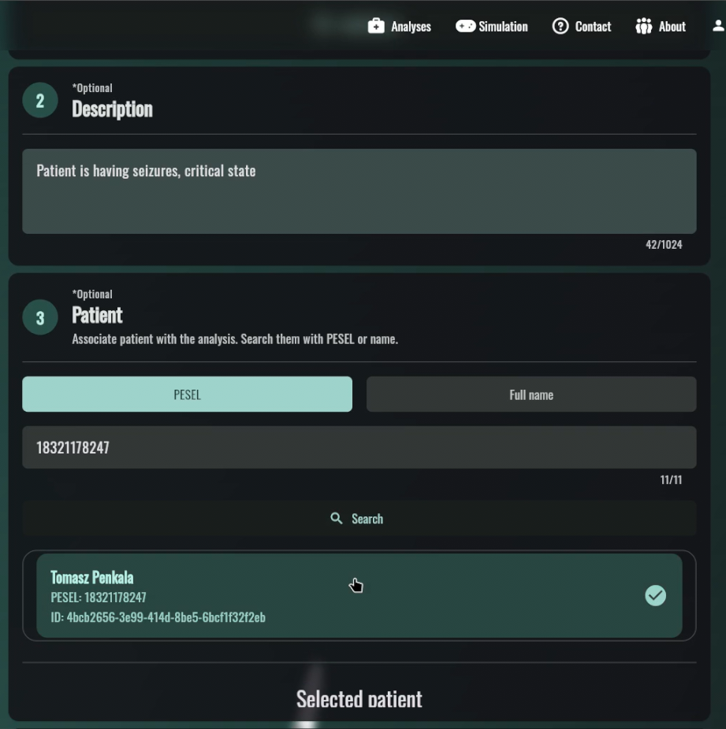
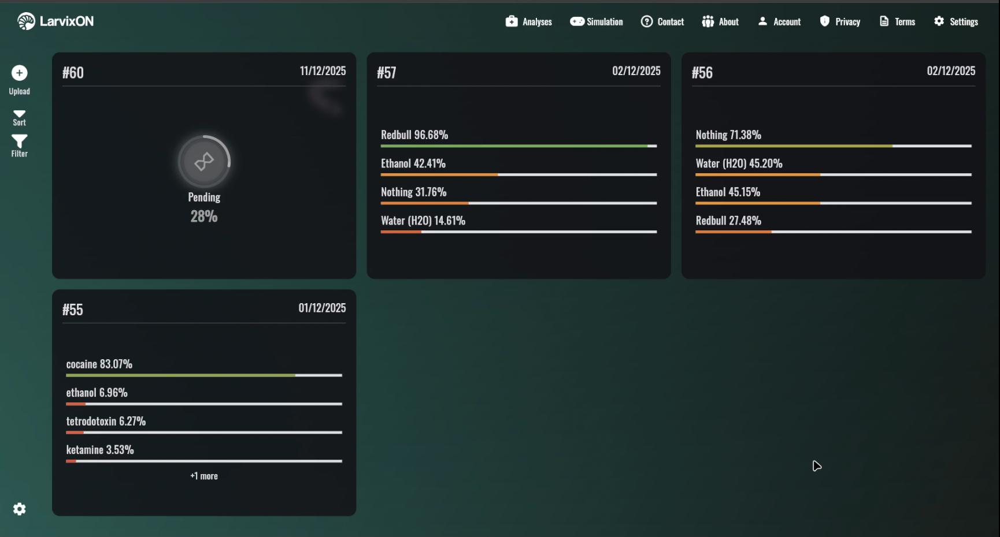
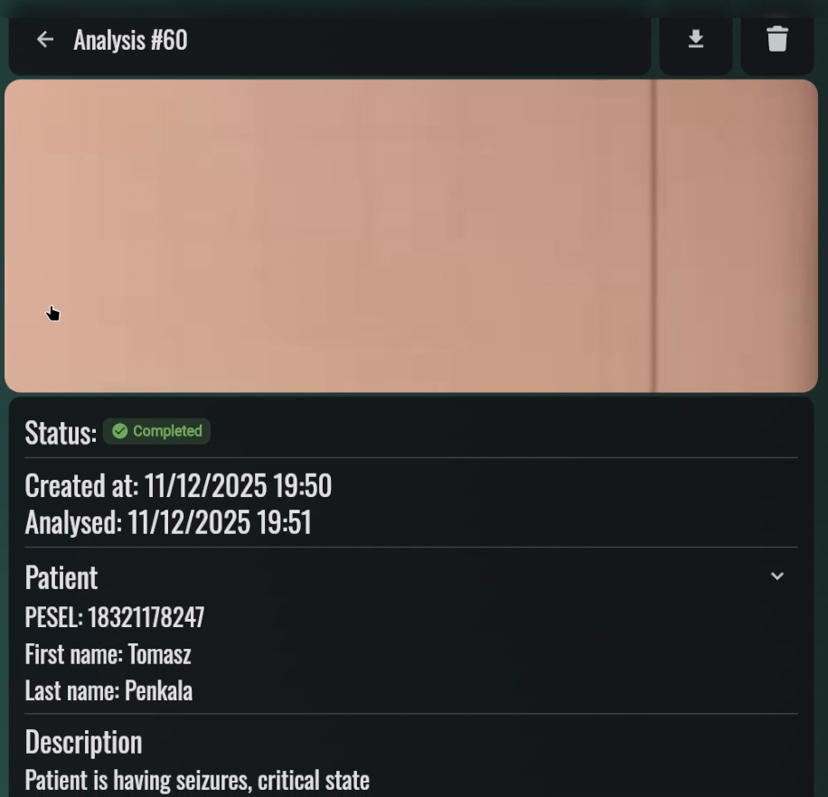

Poniżej przedstawiono kompletny scenariusz realizacji zadania diagnostycznego przez zalogowanego użytkownika. Proces ten obejmuje autoryzację, zlecenie analizy wideo, monitorowanie jej statusu oraz interpretację otrzymanych wyników.

## Krok 1: Autoryzacja

Proces rozpoczyna się na ekranie powitalnym. Jeżeli użytkownik korzystał już wcześniej z aplikacji, system automatycznie weryfikuje ważność przechowywanego lokalnie tokenu dostępu. W przypadku nowych sesji wymagane jest logowanie.

## Krok 2: Zlecenie nowej analizy

Użytkownik inicjuje proces badawczy, uruchamiając wieloetapowy kreator.

1.  **Przesłanie materiału wideo**: Wgranie pliku z nagraniem larw.
2.  **Opis kliniczny**: Opcjonalne dodanie notatek.
3.  **Wybór pacjenta**: Wyszukanie pacjenta po numerze PESEL.

## Krok 3: Monitorowanie postępu

Po zatwierdzeniu formularza, nowe zlecenie pojawia się na liście analiz (Grid). Użytkownik widzi status przetwarzania (np. _Oczekujące_, _Przetwarzanie_, _Zakończono_).

## Krok 4: Wyniki i Raportowanie

Po zakończeniu analizy przez model ML, użytkownik uzyskuje dostęp do szczegółów.

### Metadane i podgląd

Widok zawiera miniaturkę nagrania, dane pacjenta oraz status badania.

### Wyniki detekcji

Kluczowym elementem jest panel przedstawiający wykryte substancje toksyczne wraz z procentowym wskaźnikiem pewności predykcji modelu.

### Eksport raportu

Użytkownik może wygenerować sformalizowany dokument PDF, gotowy do dołączenia do dokumentacji medycznej.

