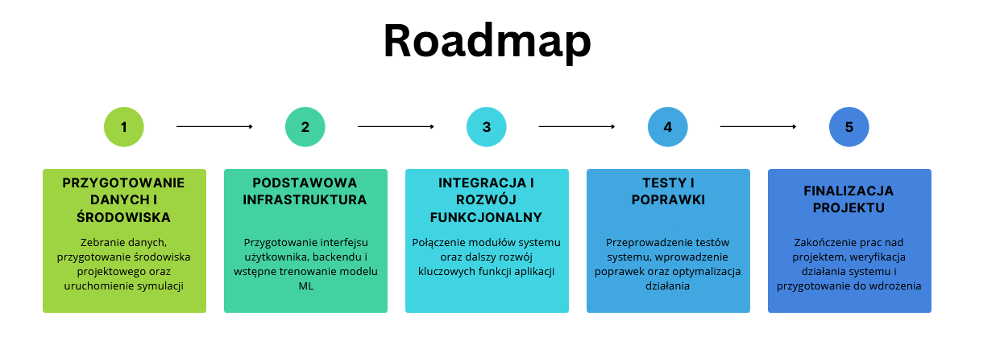

Projekt jest realizowany w pięciu głównych fazach od czerwca do grudnia 2025. Każda faza koncentruje się na różnych aspektach systemu, od fundamentów po pełną integrację i optymalizację.

---

## Przegląd osi czasu

| faza     | okres              | status       |
| -------- | ------------------ | ------------ |
| faza I   | 15.06 - 13.09.2025 | zakończona   |
| faza II  | 20.09 - 30.09.2025 | zakończona   |
| faza III | 05.10 - 31.10.2025 | w realizacji |

---

## Faza I: fundamenty, struktura i przygotowanie danych

**Okres:** 15 czerwca - 13 września 2025

### Główne cele

- Ustanowienie solidnych fundamentów projektu
- Przygotowanie infrastruktury deweloperskiej
- Zebranie i przygotowanie danych treningowych

### Kamienie milowe

#### 15.06.2025: finalizacja zbierania danych

Status: zakończony

- Zebranie nagrań wideo larw Galleria mellonella
- Wstępne czyszczenie danych
- Adnotacje w Roboflow
- Przygotowanie pierwszych zestawów treningowych

#### 16.08.2025: utworzenie repozytoriów i plan MVP

Status: zakończony

- utworzenie wszystkich repozytoriów projektu:
  - Backend (Django)
  - Frontend (Flutter)
  - Modele ML (Python)
  - Symulacja (Unity)
  - Dokumentacja
- definicja MVP (minimum viable product)
- rozpoczęcie pierwszej iteracji deweloperskiej

#### 04.09.2025: system uwierzytelniania (backend)

Status: zakończony

Zaimplementowano:

- Logowanie użytkownika
- Rejestracja nowego konta
- Uwierzytelnianie wieloskładnikowe (MFA)
- Logowanie przez Google (OAuth 2.0)
- Zarządzanie sesjami
- Uwierzytelnianie oparte na tokenach

#### 04.09.2025: symulacja — wersja przeglądowa

Status: zakończony

- Pierwsza działająca wersja symulacji Unity
- Podstawowe zachowania larw
- Gotowa do przeglądu kodu przez zespół
- Walidacja modelu biologicznego

#### 13.09.2025: symulacja v1.0.0 — pierwsze dane

Status: zakończony

Wersja 1.0.0 symulacji gotowa do:

- Generowania pierwszej partii danych testowych
- Walidacji pipeline'u generowania
- Testowania poprawności danych syntetycznych
- Wstępnego trenowania modeli ML

---

## Faza II: backend, frontend i wstępny model ML

**Okres:** 20 września - 30 września 2025

<!-- markdownlint-disable MD024 -->

### Główne cele

- Rozwój frontendu
- Implementacja API i modeli bazy danych
- Wybór i trenowanie pierwszego modelu ML
- Druga generacja danych symulacyjnych

### Kamienie milowe

#### 20.09.2025: ekrany logowania i rejestracji (frontend)

Status: zakończony

Zaimplementowano we Flutter:

- Ekran logowania z walidacją
- Formularz rejestracji
- Integracja z Google OAuth
- Wsparcie MFA
- Przejrzysty UX/UI

#### 25.09.2025: strona docelowa

Status: zakończony

- Strona główna aplikacji
- Prezentacja funkcji systemu
- Nawigacja do głównych sekcji
- Responsywny design

#### 26.09.2025: finalny wybór modelu ML

Status: zakończony

Proces wyboru:

- Analiza architektur (CNN, RNN, Transformer)
- Porównanie wydajności
- Testy na danych syntetycznych
- Wybór na podstawie:
  - Dokładności predykcji
  - Czasu wnioskowania
  - Wymagań obliczeniowych

#### 30.09.2025: panel użytkownika

Status: zakończony

Funkcje:

- Dashboard z podsumowaniem
- Historia analiz
- Zarządzanie próbkami
- Ustawienia konta

#### 30.09.2025: trenowanie na danych syntetycznych

Status: zakończony

- Pierwsza faza treningu na danych Unity
- Podstawowe metryki wydajności
- Walidacja krzyżowa
- Analiza wyników

#### 30.09.2025: modele bazy danych i endpointy API

Status: zakończony

Backend (Django):

- Finalizacja modeli bazy danych
  - User
  - Sample
  - Analysis
  - Result
  - Metadata
- Implementacja endpointów REST API
- Konfiguracja Django REST Framework
- Dokumentacja Swagger

#### 30.09.2025: symulacja v1.1.0 — pełna generacja

Status: zakończony

Symulacja v1.1.0:

- Rozszerzone scenariusze
- Zróżnicowane warunki eksperymentalne
- Generacja wszystkich zaplanowanych danych
- Większy zestaw treningowy

#### 30.09.2025: walidacja wydajności modelu ML

Status: zakończony

Metryki wydajności:

- Dokładność
- Precyzja / Recall
- F1-score
- Macierz pomyłek
- ROC AUC
- Czas predykcji na próbkę

---

## Faza III: TODO
